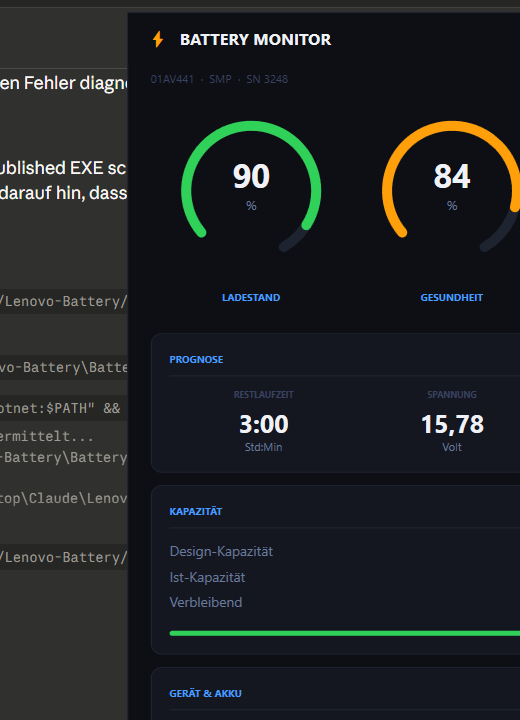

<div align="center">
  
  <h1>Battery Monitor</h1>
  <p>A lightweight, real-time battery dashboard for Windows laptops.<br/>
  Dark &amp; light theme · 13 languages · System tray · No installation required.</p>

  
  
  
  
</div>

---

## Screenshot

<div align="center">
  
</div>

---

## Features

- **Live battery data** — charge level, health, voltage, charge/discharge rate
- **Runtime estimate** — time until full or time remaining on battery
- **Capacity overview** — design capacity vs. actual full-charge capacity
- **Device info** — model, manufacturer, serial number via WMI
- **System tray icon** — shows charge %, watt, or mWh — configurable
- **Taskbar badge** — overlay on the taskbar button, color-coded by charge level
- **Dark & light theme** — toggle in the title bar
- **13 languages** — auto-detects system language on first launch
- **Portable** — single `.exe`, no installer, no registry entries

---

## Languages

| | | | | |
|---|---|---|---|---|
| 🇬🇧 English | 🇩🇪 Deutsch | 🇫🇷 Français | 🇪🇸 Español | 🇮🇹 Italiano |
| 🇵🇹 Português | 🇷🇴 Română | 🇵🇱 Polski | 🇳🇱 Nederlands | 🇹🇷 Türkçe |
| 🇷🇺 Русский | 🇨🇳 中文 | 🇯🇵 日本語 | | |

Language is auto-detected from Windows system settings on first launch and can be changed at any time via the title bar button.

---

## Download

Go to [**Releases**](../../releases/latest) and pick the right version:

| File | Description |
|---|---|
| `BatteryMonitor-win-x64-standalone.exe` | 64-bit · No .NET required · ~160 MB |
| `BatteryMonitor-win-x64-net8.exe` | 64-bit · Requires [.NET 8 Desktop Runtime](https://dotnet.microsoft.com/download/dotnet/8.0) · ~8 MB |
| `BatteryMonitor-win-arm64-standalone.exe` | ARM64 · No .NET required · ~140 MB |
| `BatteryMonitor-win-arm64-net8.exe` | ARM64 · Requires [.NET 8 Desktop Runtime](https://dotnet.microsoft.com/download/dotnet/8.0) · ~8 MB |

> **Not sure which to pick?**
> Use `win-x64-net8` if .NET 8 is already installed (most development machines).
> Use `win-x64-standalone` for a just-works portable EXE on any Windows 10/11 PC.

---

## Requirements

- Windows 10 or Windows 11
- x64 or ARM64 processor
- Battery with a standard ACPI driver (all modern laptops)
- .NET 8 Desktop Runtime — only for the `-net8` variants

---

## Build from Source

```bash
# Prerequisites: .NET 8 SDK

git clone https://github.com/lucatze/BatteryMonitor.git
cd BatteryMonitor/BatteryMonitor

# Run in debug
dotnet run

# Build release
dotnet build -c Release

# Publish single-file EXE (standalone)
dotnet publish BatteryMonitor.csproj -c Release -r win-x64 --self-contained true `
  -p:PublishSingleFile=true `
  -p:IncludeNativeLibrariesForSelfExtract=true `
  -o dist
```

---

## Tech Stack

| | |
|---|---|
| Language | C# 12 |
| Framework | .NET 8 · WPF |
| Battery data | WMI (`root\wmi`) |
| Tray icon | [Hardcodet.NotifyIcon.Wpf](https://github.com/hardcodet/wpf-notifyicon) |
| UI pattern | Code-behind (no MVVM framework) |
| Settings | `%AppData%\BatteryMonitor\settings.json` |

---

## License

MIT — see [LICENSE](LICENSE)
